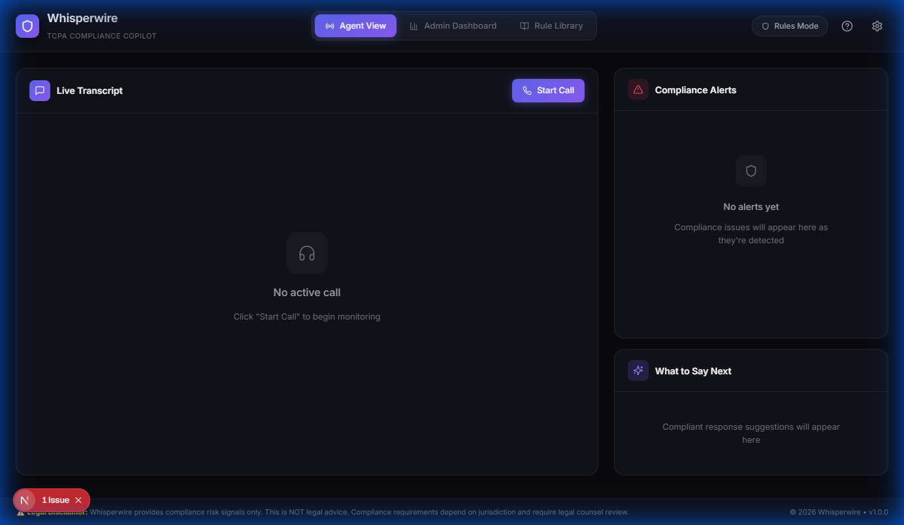
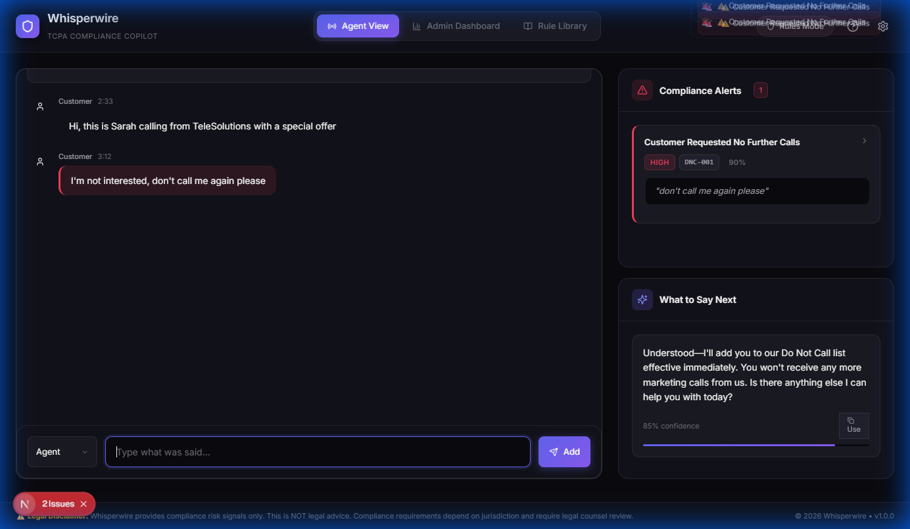
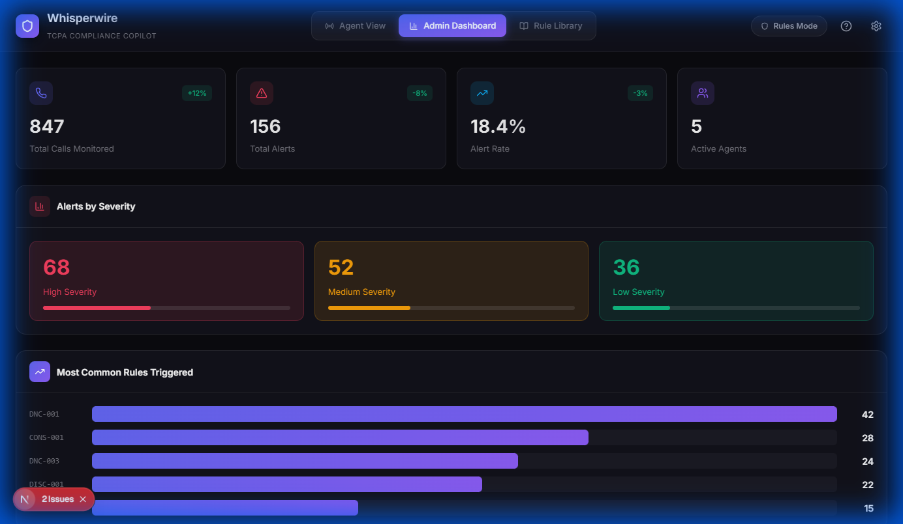
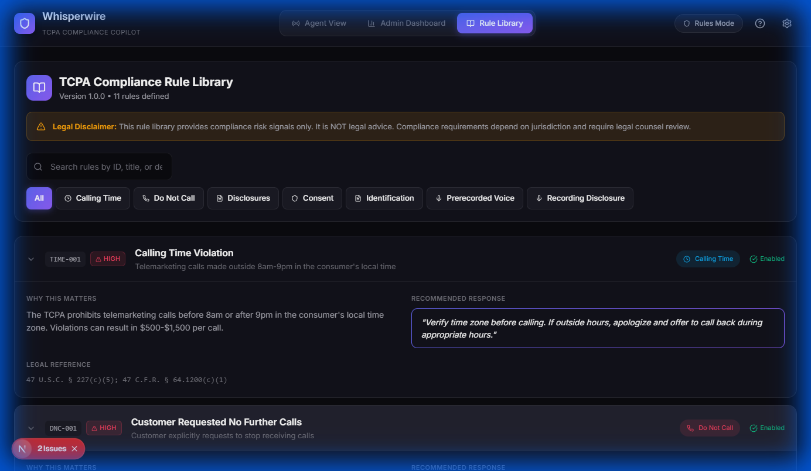

<p align="center">
  
</p>

<h1 align="center">Whisperwire</h1>

<p align="center">
  <strong>Real-time TCPA Compliance Copilot for Call Centers</strong>
</p>

<p align="center">
  <a href="#features">Features</a> •
  <a href="#screenshots">Screenshots</a> •
  <a href="#installation">Installation</a> •
  <a href="#usage">Usage</a> •
  <a href="#architecture">Architecture</a> •
  <a href="#rules">Rules</a> •
  <a href="#llm-integration">LLM Integration</a>
</p>

---

## 🎯 Overview

**Whisperwire** is a local-first, real-time compliance monitoring application designed for call center agents. It listens to live call transcripts and provides instant alerts when potential TCPA (Telephone Consumer Protection Act) violations are detected.

### Key Highlights

- 🔒 **100% Local** – No data leaves your machine
- ⚡ **Real-time Detection** – Alerts appear as violations happen
- 🤖 **LLM-Powered** – Optional local Ollama integration for nuanced analysis
- 📋 **11 TCPA Rules** – Comprehensive coverage of calling time, DNC, disclosure, and consent regulations
- 🎨 **Premium UI** – Modern dark theme with glass morphism effects

---

## 📸 Screenshots

### Agent View
The primary interface for call center agents. Shows live transcript, real-time compliance alerts, and suggested compliant responses.



### Agent View with Active Alerts
When a compliance violation is detected (e.g., customer requests Do Not Call), alerts appear immediately with severity, confidence scores, and suggested responses.



### Admin Dashboard
Analytics dashboard for supervisors showing total calls monitored, alert rates, severity breakdowns, and most common rule violations.



### Rule Library
Complete library of all 11 TCPA compliance rules with detailed explanations, legal references, and recommended responses.



---

## ✨ Features

### Agent View
- **Live Transcript** – Real-time display of conversation as it happens
- **Compliance Alerts** – Instant notifications with severity levels (High/Medium/Low)
- **Evidence Quotes** – Exact text that triggered the alert
- **Confidence Scores** – How certain the system is about each violation
- **Suggested Responses** – Pre-written compliant phrases to copy and use
- **Call Metadata** – Duration, call type, DNC status tracking

### Admin Dashboard  
- **Analytics Summary** – Total calls, alerts, and alert rate statistics
- **Severity Breakdown** – Visual breakdown of High/Medium/Low alerts
- **Top Rules Triggered** – Which compliance rules are most commonly violated
- **Alerts Log** – Filterable table of all historical alerts
- **Export** – Download alerts as JSON or CSV

### Rule Library
- **11 TCPA Rules** – All major TCPA compliance areas covered
- **Search & Filter** – Find rules by ID, title, or category
- **Category Filters** – Filter by Calling Time, DNC, Disclosures, Consent, etc.
- **Expandable Details** – "Why It Matters", legal references, trigger phrases

---

## 🚀 Installation

### Prerequisites

- **Node.js** 18+ (required)
- **Rust** (only required for desktop app build)
- **Ollama** (optional, for LLM mode)

### Option 1: Web Application (Recommended)

The fastest way to run Whisperwire - no Rust required:

```bash
# Clone the repository
git clone https://github.com/your-org/whisperwire.git
cd whisperwire/app

# Install dependencies
npm install

# Run in development mode
npm run dev
```

The application will open at **http://localhost:3000**

### Option 2: Desktop App (Tauri)

To build a standalone desktop application, you need:

1. **Install Rust** from [rustup.rs](https://rustup.rs/)
2. **Install Tauri prerequisites** - see [Tauri Prerequisites](https://tauri.app/v1/guides/getting-started/prerequisites)

Then build the app:

```bash
# Build the desktop app
npm run tauri build
```

The built executable will be in `src-tauri/target/release/`

### Optional: LLM Mode

For enhanced compliance detection with local LLM:

```bash
# Install Ollama (https://ollama.ai)
# Then pull a model:
ollama pull llama3.2:1b

# Start Ollama server
ollama serve
```

When Ollama is running, Whisperwire automatically detects it and enables "LLM Active" mode.

---

## 💻 Usage

### Starting a Call

1. Click **"Start Call"** to begin a new monitoring session
2. The call timer starts and a unique Call ID is assigned
3. Enter transcript segments using the input at the bottom:
   - Select speaker (Agent or Customer)
   - Type the message
   - Press Enter or click Add

### Handling Alerts

When a violation is detected:

1. **Alert appears** in the Compliance Alerts panel with:
   - Severity badge (High/Medium/Low)
   - Rule ID (e.g., DNC-001)
   - Confidence percentage

2. **View details** by clicking the alert to see:
   - Evidence quote
   - Why it matters
   - Suggested response

3. **Copy response** – One-click copy of compliant phrases

### Ending a Call

Click **"End Call"** to:
- Stop the timer
- Save all alerts to the database
- Reset for the next call

---

## 🏗️ Architecture

```
whisperwire/
├── app/                      # Main application
│   ├── src/                  # Next.js frontend
│   │   ├── app/              # Pages and layouts
│   │   ├── components/       # React components
│   │   │   ├── AgentView.tsx
│   │   │   ├── AdminView.tsx
│   │   │   └── RulesView.tsx
│   │   ├── lib/              # Utilities
│   │   │   ├── evaluator.ts  # Frontend rule evaluation
│   │   │   └── rules.ts      # TCPA rule definitions
│   │   └── types/            # TypeScript types
│   │
│   └── src-tauri/            # Rust backend (Tauri)
│       └── src/
│           ├── lib.rs        # Main entry, Tauri commands
│           ├── evaluator.rs  # Compliance evaluation engine
│           ├── llm.rs        # Ollama LLM integration
│           ├── rules.rs      # Rule definitions (YAML format)
│           └── database.rs   # SQLite storage
│
└── docs/                     # Documentation
    ├── architecture.md
    ├── ruleset.md
    └── images/
```

### Technology Stack

| Layer | Technology |
|-------|------------|
| Frontend | Next.js 16, React 19, TypeScript, Tailwind CSS |
| Animations | Framer Motion |
| Icons | Lucide React |
| State | React useState/useCallback |
| Notifications | React Hot Toast |
| Backend | Tauri 2.x, Rust |
| Database | SQLite (via rusqlite) |
| LLM | Ollama (local) |

---

## 📜 Rules

Whisperwire includes 11 TCPA compliance rules across 7 categories:

| Rule ID | Title | Severity | Category |
|---------|-------|----------|----------|
| TIME-001 | Calling Time Violation | 🔴 High | Calling Time |
| DNC-001 | Customer Requested No Further Calls | 🔴 High | Do Not Call |
| DNC-002 | Agent Continued After DNC Request | 🔴 High | Do Not Call |
| DNC-003 | National DNC List - No Consent | 🔴 High | Do Not Call |
| DISC-001 | Missing Seller Identity Disclosure | 🟡 Medium | Disclosures |
| DISC-002 | Missing Sales Call Nature Disclosure | 🟡 Medium | Disclosures |
| DISC-003 | Missing Product/Service Description | 🟢 Low | Disclosures |
| CONS-001 | Consent Revocation Detected | 🔴 High | Consent |
| IDENT-001 | Missing Callback Number | 🟢 Low | Identification |
| PREC-001 | Prerecorded Voice Without Consent | 🔴 High | Prerecorded |
| REC-001 | Missing Recording Disclosure | 🟡 Medium | Recording |

### Rule Detection Methods

1. **Trigger Phrases** – Exact phrase matching (e.g., "don't call me again")
2. **Regex Patterns** – Pattern matching for variations (e.g., "do not call", "stop calling")
3. **Metadata Checks** – System data like DNC list status or time zone

---

## 🤖 LLM Integration

When Ollama is running locally, Whisperwire can use an LLM for more nuanced compliance detection:

### How It Works

1. **Connection Check** – App checks for Ollama at `http://localhost:11434`
2. **Model Verification** – Confirms a supported model is available
3. **System Prompt** – All enabled rules are converted to YAML and sent as context
4. **Evaluation** – LLM analyzes transcript with full rule knowledge
5. **Structured Output** – JSON response with alerts and suggestions

### Supported Models

- `llama3.2:1b` (recommended for speed)
- `llama3.2:3b`
- `mistral`
- `gemma`

### LLM vs Rules Mode

| Feature | Rules Mode | LLM Mode |
|---------|------------|----------|
| Speed | ⚡ Instant | ~1-2 seconds |
| Accuracy | Exact matches only | Nuanced understanding |
| False Positives | Lower | May be higher |
| Offline | ✅ Yes | Needs Ollama running |

---

## ⚠️ Legal Disclaimer

> **This application provides compliance risk signals only. It is NOT legal advice.**
>
> Compliance requirements depend on jurisdiction and require review by legal counsel. TCPA rules vary by state, call type, and business relationship. Always consult with a qualified attorney before implementing compliance policies.

---

## 📄 License

MIT License - See [LICENSE](LICENSE) for details.

---

## 🙏 Acknowledgments

- [Tauri](https://tauri.app/) – For the lightweight desktop framework
- [Ollama](https://ollama.ai/) – For local LLM inference
- [Lucide](https://lucide.dev/) – For beautiful icons
- [Framer Motion](https://www.framer.com/motion/) – For smooth animations

---

<p align="center">
  Built with ❤️ for compliance teams everywhere
</p>

<p align="center">
  © 2026 Whisperwire • v1.0.0
</p>
